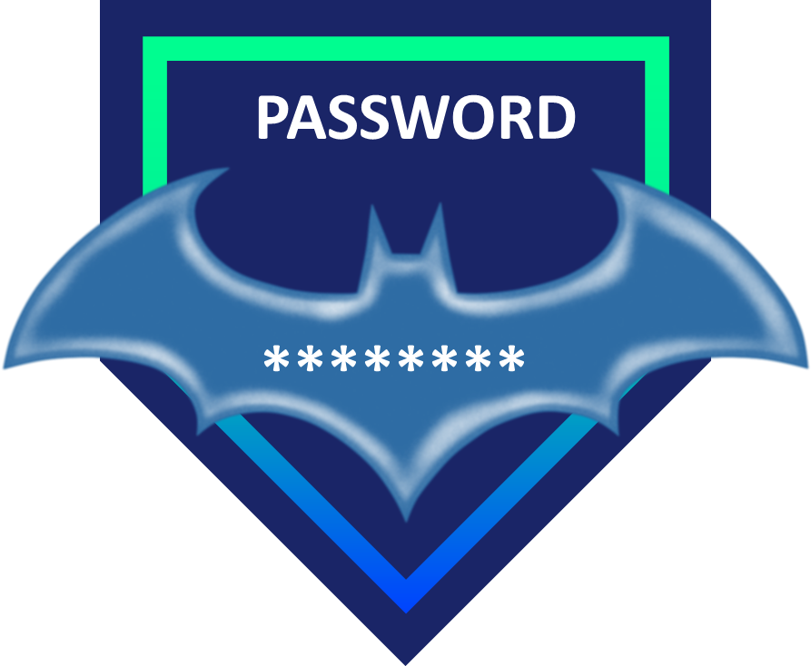

# 🦇 Bat Password Generator 🦇

<div align="center">
  
</div>

## Overview

**Bat Password Generator** is  Built with Expo, it features a clean interface and easy-to-use controls for creating and copying secure passwords.

## ✨ Features

- Generate a strong and random password with one tap
- Copy the generated password to your clipboard instantly
- Clean and intuitive user interface

## 🚀 Technologies Used

- [React Native](https://reactnative.dev/)
- [Expo](https://docs.expo.dev/)
- [expo-clipboard](https://docs.expo.dev/versions/latest/sdk/clipboard/)

## 🛠️ Getting Started

### Prerequisites

- [Node.js](https://nodejs.org/)
- [Expo CLI](https://docs.expo.dev/get-started/installation/)

### Installation

Clone the repository and install dependencies:

```bash
git clone https://github.com/Gustavo0293/react-native-bat-pass-generator.git
cd react-native-bat-pass-generator
npm install
```

### Running the App

Start the development server:

```bash
npm run start
```

Then, follow the instructions in your terminal to open the app on your device or emulator.

## 📄 Usage

1. Tap **GENERATE** to create a new strong password.
2. Tap **⚡ COPY** to copy the generated password to your clipboard.
